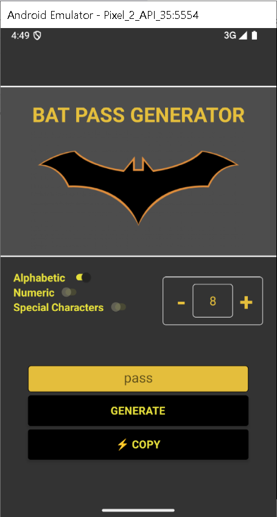
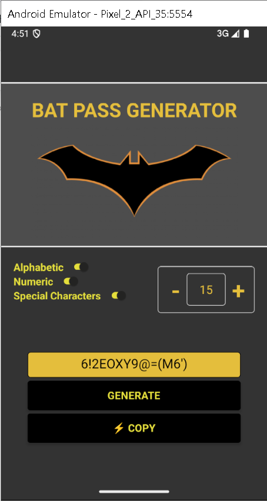

# 🦇 Batman Password Generator

Um aplicativo mobile feito em **React Native** que gera senhas seguras com parâmetros inspirados no universo do **Batman**. Personalize sua senha escolhendo letras, números e caracteres especiais, e defina o tamanho desejado.

---

## 📱 Funcionalidades

- Escolha se a senha deve conter:
  - Letras (A-Z, a-z)
  - Números (0-9)
  - Caracteres especiais (```!"#$%&'()*+,-./:;<=>?@[\]^_`{|}~```)
- Defina o tamanho da senha.
- Geração de senhas aleatórias seguras.
- Interface temática inspirada no Batman.
- Compatível com **Android** e **iOS** via React Native e Expo.

---

## ⚙️ Tecnologias

- [React Native](https://reactnative.dev/)
- [Expo](https://expo.dev/)
- TypeScript
- StyleSheet
- Randomização de caracteres

---

## 🚀 Instalação e execução

1. Clone o repositório:

```bash
git clone https://github.com/Luiz0tavi0/formacao-nodejs/tree/main/bat-pass-app
cd bat-pass-app
```

2. Instale as dependências:

```bash
npm install
# ou
yarn install
```

3. Inicie o projeto com Expo:

```bash
npx expo start
```

4. Abra no seu emulador Android/iOS ou em um dispositivo físico usando o app Expo Go.

---

## 🛠️ Uso

1. Abra o app.
2. Configure os parâmetros da senha:
   - Ative/desative letras, números e caracteres especiais.
   - Escolha o tamanho desejado.
3. Clique em **GENERATE**.
4. Clique em **COPY** para usar onde precisar.

---

## 🖼️ Prints do App

### Tela inicial / Configuração



### Senha gerada



---

## 🎨 Tema

O app traz uma **interface sombria e estilizada**, inspirada no universo do Batman, com cores escuras e elementos temáticos.

---

## 🤝 Contribuição

Contribuições são bem-vindas!  
Basta criar um fork, fazer suas alterações e abrir um Pull Request.

---

## 📝 Licença

MIT License © 2025

